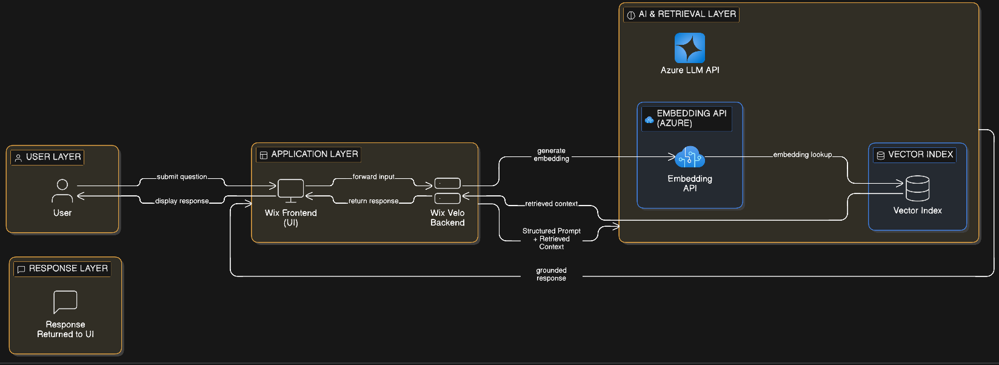
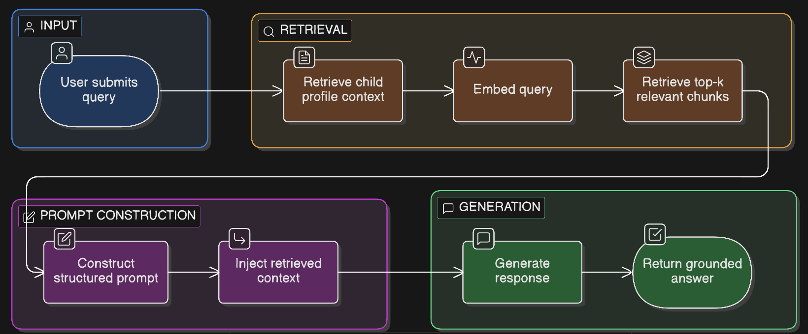
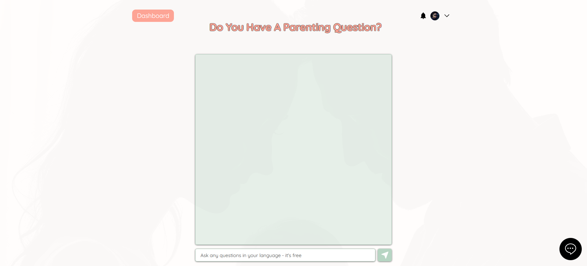
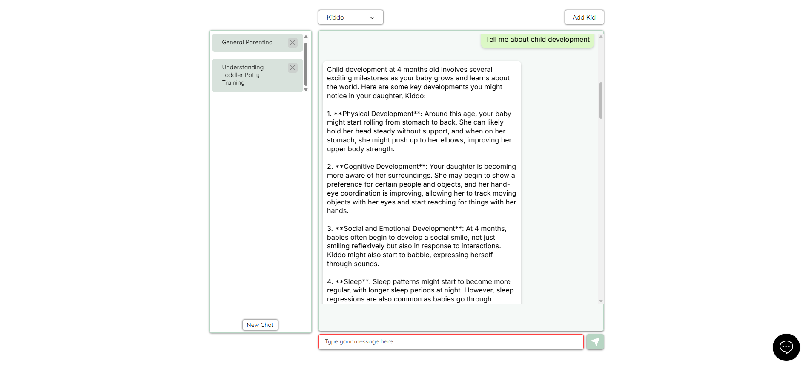
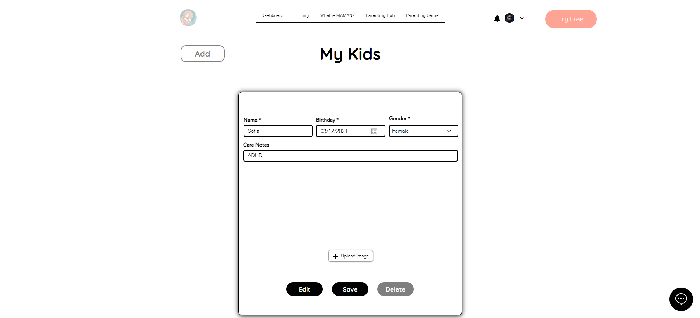

# MAMAN.AI
AI-Driven Parenting Intelligence Platform with Retrieval-Augmented Generation

Live Platform: https://www.maman.ai/

---

## Overview

MAMAN.AI is a deployed AI-powered parenting assistant designed to provide personalized, evidence-informed guidance to parents in real time.

The platform integrates a web application layer (Wix + Velo backend) with external Azure-hosted large language models and a retrieval pipeline that grounds responses in curated parenting resources.

The system demonstrates practical implementation of Retrieval-Augmented Generation (RAG) in a real-world, subscription-based product environment.

---

## Key Capabilities

- 24/7 AI-powered parenting guidance
- Retrieval-Augmented response generation
- Personalized answers based on child profile
- Multi-topic parenting conversations
- Structured dashboard for managing multiple children
- Subscription-ready architecture
- Scalable AI API integration

---

## System Architecture

### Application Layer
- Frontend: Wix website interface
- Backend: Wix Velo (server-side JavaScript logic)
- Authentication and subscription management

### AI Layer
- Azure-hosted Large Language Model APIs
- Embedding generation for semantic retrieval
- Structured prompt engineering for controlled responses

### Retrieval Layer
- Parenting resources curated and chunked
- Semantic embeddings stored in vector index
- Top-k similarity retrieval
- Context injection into generation prompt

---

## Architecture Diagrams

### System Architecture
The following diagram illustrates the layered system design and orchestration between the application layer and AI services.

### Retrieval-Augmented Generation Workflow
This diagram details the internal RAG pipeline from user query to grounded response.

The architecture separates concerns across user interface, backend orchestration, retrieval infrastructure, and generation components. The Wix Velo backend acts as the central coordinator, managing personalization signals, embedding generation, semantic retrieval, structured prompt construction, and response delivery. This layered design enables modularity and scalability while maintaining grounded AI responses.

---
 
## Retrieval-Augmented Generation Workflow

1. User submits a parenting question through the chat interface.
2. Backend retrieves relevant user context:
   - Child age
   - Care notes (for example ADHD, speech delay, etc.)
   - Selected parenting topics
3. The system embeds the query.
4. Top-k relevant parenting content chunks are retrieved from the vector index.
5. Retrieved passages are injected into a structured prompt template.
6. Azure LLM generates a grounded, context-aware response.
7. Response is returned to the user interface.

This architecture reduces hallucination and improves relevance by grounding responses in curated parenting materials.

---

## Personalization Model

The system supports child-level personalization via the "My Kids" dashboard:

Each child profile includes:
- Name
- Birthday
- Gender
- Care notes (optional developmental or medical context)

This information is appended to the retrieval and prompting pipeline, allowing the AI to tailor responses based on developmental stage and contextual needs.

---

## Interface Features (Based on Live Deployment)

### Chat Interface
Clean, focused chat environment for parenting questions.

### Premium Dashboard
Topic-based conversation management and multi-thread support.

### Child Profile Management
Dedicated UI for adding and managing children, including care notes that influence AI responses.

### Subscription System
Integrated pricing and premium feature control.

---

## My Role

- Designed and implemented the AI integration architecture
- Built the Retrieval-Augmented Generation workflow
- Structured document chunking and indexing pipeline
- Designed personalization logic using child profiles
- Prompt engineered a consistent parenting-assistant persona
- Implemented backend API orchestration using Wix Velo
- Deployed and maintained the live production system

---

## Technical Stack

- Wix (Frontend + Velo Backend)
- JavaScript (Backend logic)
- Azure AI APIs (LLM generation + embeddings)
- Vector-based retrieval pipeline
- REST-style API integrations

---

## Research Relevance

This project demonstrates applied AI system design in a real-world context, including:

- RAG architecture implementation
- Prompt engineering for domain-specific assistants
- Personalization-aware generation
- AI integration in subscription-based SaaS systems
- Scalable backend orchestration of external AI services

---
## Design Decisions and Trade-offs

### Why Retrieval-Augmented Generation Instead of Fine-Tuning

The system uses a Retrieval-Augmented Generation approach rather than fine-tuning a domain-specific model. This decision was made to:

- Allow dynamic updates to parenting resources without retraining
- Maintain flexibility in modifying or expanding the knowledge base
- Reduce infrastructure and training costs
- Improve transparency by grounding responses in retrieved content

RAG enables knowledge updates at the data layer rather than the model layer, making the system more maintainable and scalable.

### API-Based Model Integration vs Self-Hosted Models

The platform integrates Azure-hosted LLM APIs instead of deploying local models. This trade-off prioritizes:

- Production stability
- Scalability under variable user load
- Reduced operational overhead
- Faster iteration during early-stage system development

This approach sacrifices full model control but enables rapid deployment and real-world validation.

### Personalization Injection Strategy

Personalization is injected at the backend orchestration layer before prompt construction. Child profile data, including developmental stage and optional care notes, are appended as contextual signals to influence retrieval and response generation.

This design ensures that personalization modifies both retrieval relevance and final response tone, rather than only altering the final generation step.

### Chunking Strategy

Parenting resources are segmented into semantically coherent chunks suitable for embedding and similarity search. Chunking balances two competing factors:

- Larger chunks preserve contextual completeness
- Smaller chunks improve retrieval precision

The selected chunk size was optimized to maintain conceptual integrity while maximizing semantic retrieval quality.

### System Modularity

The architecture separates:

- User interface
- Backend orchestration
- Embedding and retrieval infrastructure
- Generation component

This modularity allows future migration to alternative embedding models, vector stores, or LLM providers without redesigning the entire application layer.

---

## Screenshots

### Home

### Premium dashboard

### Child profile management

---

## Status

Deployed and publicly accessible.
Actively maintained.
